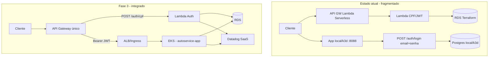

# Contexto Fase 3 — Tech Challenge Autoservice (4 repositórios)

> **Documento vivo** para orientar humanos e agentes sobre o ecossistema Autoservice e o progresso da Fase 3 do Tech Challenge FIAP (SOAT).
>
> **Última atualização:** 2026-09-13 (Datadog validado + monitors importados + branch PR)  
> **Leia este arquivo antes** de implementar mudanças nos repositórios listados abaixo.

---

## 0) Progresso rápido (última sessão)

| Item | Status |
|------|--------|
| Datadog local (APM + Agent + logs) | ✅ validado `env:local` |
| Dashboard compartilhado JSON | ✅ importado na org |
| OBS-01 Logs Correlation | ✅ Trace(1) + `dd.trace_id` no JSON |
| OBS-02 Volume diário OS | ✅ `autoservice.ordem_servico.volume_diario` |
| OBS-03 Tempo médio por fase | ✅ `autoservice.ordem_servico.tempo_fase{fase}` |
| OBS-09 Dashboard widgets OS | ✅ |
| OBS-06 Alertas Datadog | ✅ importados (IDs abaixo) |
| F3-AUTH-01 JWT Lambda no Spring | ✅ código local (PR separado pendente) |
| **Branch PR Datadog** | `feature/datadog-observability` → `main` |
| **Próximo** | F3-AUTH-02 API Gateway E2E, F3-DEPLOY-01 EKS, OBS-04 Agent EKS |

**Monitors importados (org Datadog, 2026-09-12):**

| Monitor | ID |
|---------|-----|
| Taxa de erros 5xx elevada | 321293624 |
| Health check com falha | 321293625 |
| Falhas em ordens de serviço | 321293626 |
| Ausência de requisições (uptime) | 321293630 |

**Métricas custom (DogStatsD → Agent:8125):**
- `autoservice.ordem_servico.abertura` — counter ao criar OS
- `autoservice.ordem_servico.volume_diario` — gauge (OS abertas hoje)
- `autoservice.ordem_servico.tempo_fase` — timer por fase: diagnostico, execucao, finalizacao
- `autoservice.ordem_servico.erro` — counter em falhas `/ordens-servico`

**Import Datadog (Windows PowerShell 5.1):**
```powershell
# Dashboard
powershell -ExecutionPolicy Bypass -File .\scripts\import-datadog-dashboard.ps1
# Monitors (requer DD_APP_KEY)
powershell -ExecutionPolicy Bypass -File .\scripts\import-datadog-monitors.ps1
```

**Auth JWT Lambda (F3-AUTH-01)** — implementado localmente, fora da branch Datadog:
- Mesmo secret: `AUTOSERVICE_JWT_SECRET` = `JWT_SECRET` (Lambda)
- Mesmo issuer: `AUTOSERVICE_JWT_ISSUER` = `JWT_ISSUER` (default `autoservice-auth`)
- Token Lambda: claims `cpf`, `status`, `iss`, `exp` (sem `sub`)
- Cliente autenticado: `ROLE_CLIENTE` → `GET /clientes/cpf/{cpf}`

**Código observabilidade:** `infrastructure/observability/`

---

## 1) Objetivo deste documento

Consolidar o contexto necessário para qualquer agente atuar no ecossistema **Autoservice** sem depender de leitura prévia do PDF, board ou código completo.

**Escopo:**
- Requisitos oficiais do PDF *13SOAT - Fase 3 - Tech Challenge*
- Papel e estado de cada um dos 4 repositórios
- Gaps prioritários e ordem sugerida de implementação
- Referências cruzadas (paths, branches, contratos entre repos)

**Localização:** `autoservice/.cursor/contexto-fase-3-tech-challenge.md`  
**Workspace multi-root:** todos os 4 repos estão no mesmo workspace Cursor.

---

## 2) Repositórios do ecossistema

| # | Repositório | Path local | Branch (2026-09-12) | Papel |
|---|-------------|------------|---------------------|-------|
| 1 | `autoservice` | `C:\Users\Rafael\code\autoservice` | `main` | API Spring Boot — OS, clientes, veículos, estoque, métricas |
| 2 | `autoservice-lambda-auth` | `C:\Users\Rafael\code\autoservice-lambda-auth` | `develop` | Lambda Python — valida CPF, consulta cliente, emite JWT |
| 3 | `autoservice-infra-db` | `C:\Users\Rafael\code\autoservice-infra-db` | `develop` | Terraform — RDS PostgreSQL (homolog/prod) |
| 4 | `autoservice-infra-k8s` | `C:\Users\Rafael\code\autoservice-infra-k8s` | `develop` | Terraform — VPC, EKS, ALB, API Gateway HTTP |

---

## 3) Requisitos do PDF — Fase 3

A oficina evolui para operação corporativa. Requisitos obrigatórios:

### Autenticação e API Gateway
- API Gateway (AWS API Gateway, Kong, Traefik ou similar)
- Rotas sensíveis protegidas com autenticação via **CPF**
- Function Serverless que:
  - valida CPF;
  - consulta existência/status do cliente no banco;
  - gera e devolve JWT para APIs protegidas

### Estrutura de repositórios e CI/CD
- **4 repositórios separados**, cada um com CI/CD e deploy automático para a nuvem
- Branch `main`/`master` protegida (sem commits diretos)
- Pull Requests obrigatórios
- Deploy automático de homologação e produção

### Infraestrutura obrigatória
- API Gateway
- Function Serverless (autenticação)
- Banco de Dados Gerenciado (PostgreSQL, MySQL, etc.)
- Cluster Kubernetes escalável
- Terraform para provisionamento

### Monitoramento e observabilidade
- Integração com **Datadog** ou **New Relic**
- Monitorar: latência APIs, CPU/memória K8s, healthchecks/uptime, alertas falha OS, logs JSON com correlação
- Dashboards: volume diário de OS, tempo médio por status (Diagnóstico, Execução, Finalização), erros de integração

### Documentação arquitetural
- Diagrama de componentes (nuvem, APIs, banco, monitoramento)
- Diagrama de sequência (auth + abertura OS)
- RFCs e ADRs
- Justificativa do banco + diagrama ER

### Entregáveis finais
- 4 repos com README, Dockerfiles (quando aplicável), CI/CD, links de deploy
- Vídeo demo (≤ 15 min)
- PDF único no Portal do Aluno com links + usuário `soat-architecture` em todos os repos

---

## 4) Estado atual por repositório

### 4.1 `autoservice` (aplicação principal)

**Stack:** Java 21, Spring Boot 3.5.13, Spring Security, JPA, PostgreSQL, JWT, Actuator, OpenAPI/Swagger, JaCoCo, SonarQube (profile local).

**APIs principais:**

| Área | Base path |
|------|-----------|
| Auth (atual) | `/auth` — `POST /login` (email/senha admin) |
| Atendimento / abertura OS | `/atendimentos` |
| Ordens de serviço | `/ordens-servico` |
| Métricas tempo médio | `/ordens-servico/metricas/tempo-medio-execucao` |
| Catálogo, peças, estoque, ordens de compra | `/servicos`, `/pecas`, `/estoques`, `/ordens-compra` |

**Auth atual:** Dupla via JWT — (1) admin: `POST /auth/login` → token com `sub` email; (2) cliente: token Lambda com claim `cpf` + `iss`. Mesmo `JWT_SECRET` nos dois repos. Admin mantém acesso total; cliente acessa `GET /clientes/cpf/{cpf}`.

**Infra local:** Docker, manifestos K8s em `/k8s` (HPA, PVC), Terraform local em `/infra` (k3d + Helm Postgres).

**CI/CD:** `.github/workflows/ci-cd.yml` — build, testes, push GHCR, deploy em **k3d local** (runner self-hosted), **não** EKS AWS.

**Observabilidade:** ✅ Datadog local validado (`env:local`, serviço `autoservice` no APM). Logs JSON + `X-Correlation-Id` + `dd-java-agent` + `datadog-agent` no docker-compose. Dashboard + 4 monitors versionados em `docs/observability/`. Branch `feature/datadog-observability` pronta para PR → `main`.

**Documentação:** README completo (foco Fase 2). Sem ADRs/RFCs neste repo.

---

### 4.2 `autoservice-lambda-auth`

**Stack:** Python 3.11, AWS Lambda, Serverless Framework, JWT HS256, psycopg2.

**Endpoint:** `POST /auth/cpf` — valida CPF, consulta `clientes` no PostgreSQL, emite JWT.

**Variáveis:** `JWT_SECRET`, `JWT_ISSUER`, `JWT_EXPIRES_SECONDS`, `DB_*`, `DATADOG_API_KEY` (mencionado no README, **não implementado** no código).

**CI/CD:** múltiplos workflows (`ci.yml`, `dev.yml`, `prod.yml`) com estratégias inconsistentes.

**Gap:** `swagger.yaml` citado no README mas ausente no repo.

---

### 4.3 `autoservice-infra-db` (~90% concluído)

**Conteúdo:** Terraform modular RDS PostgreSQL — SG, subnet group, parameter group, Secrets Manager, ambientes homolog/prod.

**CI/CD:** `.github/workflows/terraform.yml` — validate em PR, apply em push homolog/prod.

**Documentação:** RFC, ADR, ER, `docs/STATUS-ADERENCIA-TECH-CHALLENGE.md`.

**Outputs para integração:**
- `jdbc_url` → `SPRING_DATASOURCE_URL` no autoservice
- `lambda_environment` → `DB_HOST`, `DB_PORT`, `DB_NAME`, `DB_USER` na Lambda
- `security_group_id` → whitelist EKS/Lambda

**Pendências:** links reais de deploy, wiring de SGs, evidências de apply.

---

### 4.4 `autoservice-infra-k8s`

**Conteúdo:** Terraform — VPC/subnets/NAT, EKS + node group, API Gateway HTTP + VPC Link + ALB.

**CI/CD:** `.github/workflows/terraform-ci.yml` — fmt, validate, plan, apply.

**Gap:** menciona Datadog no README mas **sem módulos/recursos** de observabilidade no Terraform. App ainda não deploya neste EKS.

---

## 5) Diagrama — estado atual vs alvo



---

## 6) Gap analysis consolidado

| Requisito Fase 3 | Status | Observação |
|------------------|--------|------------|
| 4 repositórios separados | ✅ Parcial | Criados; branches divergem (`main` vs `develop`) |
| Auth CPF + JWT | ⚠️ | Lambda + validação Spring OK; falta API Gateway E2E |
| API Gateway | ⚠️ | Existe no Serverless e no Terraform k8s; sem integração E2E |
| Lambda serverless | ✅ Parcial | Funcional; pipelines inconsistentes |
| RDS gerenciado (Terraform) | ✅ Forte | infra-db maduro; falta wiring operacional |
| EKS + K8s (Terraform) | ⚠️ | Terraform pronto; app deploya em k3d local |
| CI/CD homolog/prod | ⚠️ | Workflows existem; estratégias de branch inconsistentes |
| Observabilidade | ⚠️ | Datadog local + dashboard + métricas OS + alertas; faltam EKS/Lambda Extension |
| Documentação ADR/RFC/diagramas | ⚠️ | Só infra-db completo |
| Entrega (vídeo, PDF, soat-architecture) | ❌ | Pendente |

---

## 7) Gaps prioritários (ordem sugerida)

1. ~~**Unificar autenticação**~~ ✅ Spring valida JWT Lambda (`cpf`); `/auth/login` permanece para admin
2. **Integrar API Gateway (F3-AUTH-02)** — ver seção 13
3. **Migrar deploy para AWS (F3-DEPLOY-01)** — CI/CD do `autoservice` → EKS + RDS (não k3d)
4. **Observabilidade (Datadog)** — ✅ base local (APM + logs JSON + dashboard versionado); ver seção 12 para pendências
5. **Documentação Fase 3** — diagrama sequência, ADRs no app e lambda
6. **Evidências de entrega** — links deploy, vídeo, PDF, `soat-architecture`

---

## 8) Contratos entre repositórios

```
autoservice-infra-db
  ├─ jdbc_url / db_username        → autoservice (SPRING_DATASOURCE_*)
  ├─ lambda_environment (DB_*)   → autoservice-lambda-auth
  └─ security_group_id             → autoservice-infra-k8s (EKS nodes) + Lambda SG

autoservice-infra-k8s
  ├─ EKS cluster + ALB endpoint    → autoservice (deploy CI/CD)
  └─ API Gateway URL               → cliente externo

autoservice-lambda-auth
  └─ JWT (mesmo JWT_SECRET)        → autoservice (validação Spring)
```

---

## 9) Observabilidade — plano Datadog (próximo incremento)

> **Decisão do grupo:** usar Datadog (requisito do PDF permite Datadog ou New Relic).

### Por que Datadog atende o requisito de dashboard compartilhado

Datadog é **SaaS** (`https://app.datadoghq.com`). Dashboards **não ficam na máquina local** — ficam na organização Datadog. Qualquer membro convidado à org (Standard/Read-only) acessa os mesmos dashboards, alertas e logs.

### Componentes a instrumentar

| Camada | Repo | Ação |
|--------|------|------|
| App Spring Boot | `autoservice` | `dd-java-agent` no Dockerfile + logs JSON Logback + MDC `trace_id`/`correlation_id` |
| Lambda auth | `autoservice-lambda-auth` | Datadog Lambda Extension + layer Python |
| Kubernetes | `autoservice-infra-k8s` | Helm chart `datadog` (Agent DaemonSet + Cluster Agent) |
| RDS | `autoservice-infra-db` | Integração AWS via Datadog (métricas RDS nativas) |
| Dashboards | novo ou `autoservice-infra-k8s` | Terraform provider `DataDog/datadog` ou JSON versionado |

### Dashboards obrigatórios (PDF)

1. **Latência P95** por endpoint (`/ordens-servico`, `/atendimentos`, etc.)
2. **Volume diário de OS** (métrica custom ou query sobre logs/eventos)
3. **Tempo médio por status** (Diagnóstico, Execução, Finalização) — reutilizar endpoint `/ordens-servico/metricas/tempo-medio-execucao` exportando como métrica
4. **CPU/memória** pods K8s + restarts
5. **Health/uptime** — synthetics ou monitor em `/actuator/health`
6. **Erros 5xx** e falhas de integração
7. **Alertas** — taxa erro OS, falha transição de status

### Secrets necessários (GitHub + K8s)

| Secret | Onde |
|--------|------|
| `DD_API_KEY` | Todos os repos / K8s Secret |
| `DD_APP_KEY` | Terraform dashboards (opcional) |
| `DD_SITE` | `datadoghq.com` (US) ou `datadoghq.eu` (EU) |
| `DD_ENV` | `homolog` / `prod` |

### Ordem de implementação Datadog

```
1. ✅ Criar org Datadog + convidar equipe + gerar API keys
2. ✅ Logs JSON + correlation ID na app
3. ✅ dd-java-agent no Dockerfile autoservice
4. ✅ Datadog Agent no docker-compose (local)
5. ✅ Dashboard versionado (JSON importável)
6. ✅ Logs correlation (link trace ↔ log no Datadog)
7. ✅ Custom metrics: volume OS / tempo por fase
8. ⏳ Datadog Agent Helm no EKS (infra-k8s)
9. ⏳ Lambda Extension no serverless.yml
10. ✅ Monitors/alertas (`docs/observability/monitors/`)
11. ⏳ Validar traces E2E: auth CPF → API OS → logs correlacionados
```

### Dashboard compartilhado (concluído)

- **Arquivo:** `docs/observability/dashboards/autoservice-tech-challenge.json`
- **Import UI:** Datadog → Dashboard → ⚙ Configure → Import dashboard JSON
- **Import script:** `scripts/import-datadog-dashboard.ps1` (requer `DD_API_KEY` + `DD_APP_KEY`)
- **Windows:** usar `powershell -ExecutionPolicy Bypass -File ...`

### Monitors/alertas (concluído)

- **Arquivo:** `docs/observability/monitors/autoservice-monitors.json`
- **Import script:** `scripts/import-datadog-monitors.ps1`
- **Gotcha PS 5.1:** JSON com caracteres especiais quebra no `ConvertTo-Json`; script usa `JavaScriptSerializer` + UTF-8
- **Validado:** 4 monitors criados na org (IDs na seção 0)

### Custo

- Trial 14 dias gratuito
- Plano pago após trial (~US$ 15/host/mês infra + APM)
- Para demo acadêmica: manter infra ligada só durante gravação do vídeo; usar `DD_ENV=homolog`

---

## 10) Backlog — observabilidade e Fase 3 (pendente)

| ID | Tarefa | Repo | Prioridade | Status |
|----|--------|------|------------|--------|
| OBS-01 | **Logs Correlation** — link trace ↔ log no Datadog (`DD_LOGS_INJECTION` + pipeline logs) | `autoservice` | Alta | ✅ Concluído |
| OBS-02 | **Custom metric: volume diário de OS** — gauge `volume_diario` via DogStatsD | `autoservice` | Alta | ✅ Concluído |
| OBS-03 | **Custom metric: tempo médio por status** — timer `tempo_fase{fase}` em transições | `autoservice` | Alta | ✅ Concluído |
| OBS-04 | **CPU/memória pods K8s** — Datadog Agent Helm no EKS | `autoservice-infra-k8s` | Média | ⏳ Pendente |
| OBS-05 | **Health/uptime** — Synthetic monitor em `/actuator/health` | Datadog UI / Terraform | Média | ⏳ Pendente |
| OBS-06 | **Alertas** — taxa 5xx > limiar; falha OS (`ordem_servico.erro`) | Datadog Monitors | Média | ✅ Concluído |
| OBS-07 | **Lambda Extension** — traces auth CPF | `autoservice-lambda-auth` | Média | ⏳ Pendente |
| OBS-08 | **Integração AWS** — RDS/API Gateway metrics no Datadog | `autoservice-infra-db`, `autoservice-infra-k8s` | Baixa | ⏳ Pendente |
| OBS-09 | Atualizar widgets do dashboard após OBS-02 e OBS-03 | `autoservice` | Alta | ✅ Concluído |

### Outras pendências Fase 3 (não-observabilidade)

| ID | Tarefa | Status |
|----|--------|--------|
| F3-AUTH-01 | Spring validar JWT da Lambda (claim `cpf`) | ✅ Concluído |
| F3-AUTH-02 | Integrar API Gateway end-to-end (ver seção 13) | ⏳ Pendente |
| F3-DEPLOY-01 | CI/CD app → EKS + RDS (não k3d) | ⏳ Pendente |
| F3-DOC-01 | Diagrama sequência auth + abertura OS | ⏳ Pendente |
| F3-DOC-02 | ADRs/RFCs no app e lambda-auth | ⏳ Pendente |
| F3-ENTREGA-01 | Vídeo demo + PDF portal + `soat-architecture` | ⏳ Pendente |

---

## 11) Referências úteis

| Recurso | Path / URL |
|---------|------------|
| PDF Fase 3 | `C:\Users\Rafael\Documents\Pos FIAP\13SOAT - Fase 3 - Tech Challenge.pdf` |
| Status aderência DB | `autoservice-infra-db/docs/STATUS-ADERENCIA-TECH-CHALLENGE.md` |
| ADR PostgreSQL | `autoservice-infra-db/docs/adr/0001-use-aws-rds-postgresql.md` |
| RFC plataforma DB | `autoservice-infra-db/docs/rfc/0001-database-platform-and-networking.md` |
| Swagger app | `http://localhost:8088/swagger-ui.html` |
| Postman | `autoservice/Autoservice API.postman_collection.json` |
| Plano tarefas (monorepo legado) | `tech-challenge-fiap-oficina/.cursor/outputs/fase-3-tasks.md` |
| Dashboard Datadog (JSON) | `docs/observability/dashboards/autoservice-tech-challenge.json` |
| Guia Datadog local | `docs/observability/datadog-local.md` |
| Import dashboard | `docs/observability/dashboards/README.md` |
| Monitors/alertas | `docs/observability/monitors/README.md` |
| Teste JWT Lambda | `LambdaJwtAuthenticationIntegrationTest.java` |

---

## 12) Instruções para agentes

1. **Leia este arquivo** antes de alterar qualquer repo do ecossistema.
2. **Minimize escopo** — mudanças focadas no requisito atual (ex.: Datadog não deve refatorar auth).
3. **Respeite contratos** entre repos (outputs Terraform, JWT secret compartilhado).
4. **Não commite secrets** — use GitHub Secrets, K8s Secrets, `.env` local.
5. **Branches:** alinhar `develop` → homolog, `main`/`prod` → produção quando possível.
6. **Responda em português** ao usuário.
7. Ao concluir incrementos, **atualize este arquivo** (seções 0, 4, 6 e 10).
8. Consulte a **seção 10** para tarefas pendentes antes de iniciar novo incremento.

---

## 13) F3-AUTH-02 — API Gateway end-to-end (pendente)

**Problema hoje:** existem **dois** entry points separados:
- API Gateway do **Serverless** (`autoservice-lambda-auth`) → só `POST /auth/cpf`
- App Spring em **local/k3d** (`:8088`) ou, no futuro, EKS atrás de outro API Gateway (`autoservice-infra-k8s`)

**Alvo:** **uma URL pública** (API Gateway do Terraform) para todo o tráfego externo:

```
Cliente
  └─► API Gateway (infra-k8s)
        ├─ POST /auth/cpf        → Lambda (autoservice-lambda-auth)
        └─ /ordens-servico, ...  → ALB → EKS (autoservice-app) + Bearer JWT
              Lambda ──► RDS
              EKS    ──► RDS
```

**Passos técnicos:**

| # | Repo | Ação |
|---|------|------|
| 1 | `autoservice-infra-k8s` | Terraform: rota `POST /auth/cpf` → integração Lambda; demais rotas → ALB/EKS (hoje só `$default` → cluster) |
| 2 | `autoservice-lambda-auth` | Alinhar deploy com gateway unificado (ou expor ARN da Lambda para o Terraform) |
| 3 | `autoservice` + CI/CD | Deploy no EKS (F3-DEPLOY-01), `JWT_SECRET` igual à Lambda |
| 4 | `autoservice-infra-db` | SGs: Lambda e EKS acessam RDS |
| 5 | Teste E2E | Token via gateway → API de negócio via **mesma URL** → 200 |

**Dependência:** F3-AUTH-02 e F3-DEPLOY-01 andam juntos — sem app no EKS, rotas de negócio no gateway retornam 502/503.

**Opcional:** JWT Authorizer no API Gateway (validação antes do EKS); Spring já valida JWT (F3-AUTH-01).
