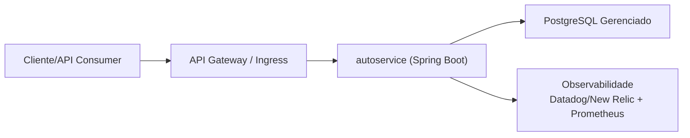
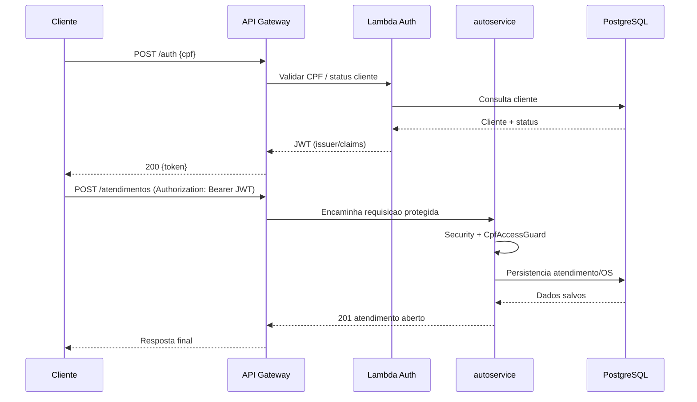

# Autoservice - API principal (Kubernetes)

Back-end monolitico em camadas (Spring Boot 3 / Java 21) para gestao de ordens de servico, clientes, veiculos, pecas, estoque e metricas operacionais.

Este repositorio contem somente a aplicacao principal:
- codigo-fonte Java;
- testes;
- Dockerfile e empacotamento da imagem;
- contrato de integracao com os demais repositorios.

## Repositorios do ecossistema

| Repositorio | Responsabilidade |
| --- | --- |
| `autoservice` | API principal |
| `autoservice-lambda-auth` | Validacao de CPF e emissao de JWT |
| `autoservice-infra-db` | Banco gerenciado (Terraform) |
| `autoservice-infra-k8s` | Cluster e deploy Kubernetes (Terraform/manifests) |

## Diagrama de arquitetura deste repositorio (aplicacao principal)



## Como rodar localmente

### Pre-requisitos

- JDK 21
- Maven (ou `mvnw`)
- PostgreSQL local (ou Docker)

### Variaveis principais

| Variavel | Exemplo |
| --- | --- |
| `SPRING_DATASOURCE_URL` | `jdbc:postgresql://localhost:5432/autoservice` |
| `SPRING_DATASOURCE_USERNAME` | `postgres` |
| `SPRING_DATASOURCE_PASSWORD` | `postgres` |
| `AUTOSERVICE_JWT_SECRET` | `dev-secret` |
| `AUTOSERVICE_JWT_ISSUER` | `autoservice-auth` |
| `APP_BASE_URL` | `http://localhost:8088` |

Copie `local.variable.env.example` para `local.variable.env` e ajuste os valores.

### Build e execucao

```bash
./mvnw clean verify
./mvnw spring-boot:run
```

Swagger: `http://localhost:8088/swagger-ui.html`

## Swagger / Postman (publicado)

- Swagger (ambiente publicado): `https://<PREENCHER-SWAGGER-PUBLICO>`
- Postman Collection (publicada): `https://<PREENCHER-LINK-POSTMAN>`
- OpenAPI local: `http://localhost:8088/v3/api-docs`

## Docker

```bash
docker compose -f docker/docker-compose.yaml up --build
```

- API: `http://localhost:8088`
- Postgres: `localhost:5432`

## CI/CD deste repositorio

Pipeline em `.github/workflows/ci-cd.yml`:
1. build e testes da aplicacao;
2. build da imagem Docker;
3. push da imagem para GHCR (branches `homolog` e `prod`).

O deploy no cluster e o provisionamento de infraestrutura ficam nos repositorios `autoservice-infra-k8s` e `autoservice-infra-db`.

## Links de deploy por ambiente (publicado)

- Homolog: `https://<PREENCHER-HOMOLOG>`
- Producao: `https://<PREENCHER-PROD>`

## Contrato com os outros repositorios

- A Lambda de autenticacao emite JWT com `issuer` e segredo alinhados com `AUTOSERVICE_JWT_ISSUER` e `AUTOSERVICE_JWT_SECRET`.
- O repositorio de banco fornece endpoint/credenciais do PostgreSQL para `SPRING_DATASOURCE_*`.
- O repositorio de infra Kubernetes consome a imagem publicada por este repositorio.

### Contrato JWT e autorizacao por CPF

O token do cliente deve ser assinado com HS256 e conter `iss` igual a
`AUTOSERVICE_JWT_ISSUER`, `sub` com o CPF do cliente, `roles` com `CUSTOMER`
e `exp` com uma expiracao futura. Tokens sem `exp`, expirados, com assinatura
invalida ou issuer diferente sao recusados com HTTP 401. O claim `cpf` nao
substitui o `sub` na autorizacao. A validacao da existencia e do status do
cliente na emissao continua sendo responsabilidade da Lambda.

Para `CUSTOMER`, a abertura de atendimento e a consulta por CPF exigem que o
CPF informado corresponda ao `sub`. As rotas GET abaixo tambem exigem que o
CPF do proprietario da OS (OS -> veiculo -> cliente -> pessoa fisica)
corresponda ao `sub`:

- `/ordens-servico/{id}/andamento`
- `/ordens-servico/{id}/aprovacao/aprovar`
- `/ordens-servico/{id}/aprovacao/reprovar`

OS de outro cliente, inexistente ou sem proprietario pessoa fisica com CPF
retorna HTTP 403 para `CUSTOMER`. O perfil `ADMIN` preserva seu acesso,
inclusive a OS de pessoa juridica. Os endpoints PATCH de aprovacao/reprovacao
continuam restritos a `ADMIN`. Nas rotas protegidas, envie
`Authorization: Bearer <token>`; abrir um link de e-mail sem esse header nao
autentica o cliente.

## Fluxo de autenticacao e abertura de OS (sequencia)



## Observabilidade (Datadog/New Relic)

Integracoes implementadas neste repositorio:
- Logs estruturados em JSON (`logback-spring.xml`);
- Correlacao por requisicao com `X-Correlation-Id` (`RequestCorrelationFilter`);
- Metricas via Actuator/Micrometer (`/actuator/metrics` e `/actuator/prometheus`);
- Metricas de negocio:
  - `autoservice.service_orders.opened.total`
  - `autoservice.service_orders.status_transitions.total`
  - `autoservice.notifications.webhook.result`
  - `autoservice.notifications.webhook.latency`

Como conectar na ferramenta final (Datadog/New Relic):
1. Coletar logs JSON da aplicacao no cluster.
2. Coletar metricas Prometheus/Micrometer do endpoint da app.
3. Criar dashboards com latencia, erros HTTP, volume de OS e transicoes por status.
4. Configurar alertas operacionais (abaixo).

Evidencias a anexar na entrega:
- prints dos dashboards;
- print dos alertas configurados;
- print de logs com `correlationId` atravessando requisicoes.

## Alertas operacionais obrigatorios

### 1) Falhas no processamento de ordem de servico
- **Sinal:** aumento de `autoservice.notifications.webhook.result{result="exception|failed|interrupted"}`.
- **Criterio sugerido:** disparar alerta se houver `>= 3` falhas em `5m`.
- **Severidade sugerida:** alta.

### 2) Latencia de API
- **Sinal:** p95/p99 de latencia HTTP (por rota critica: `/atendimentos`, `/ordens-servico/**`).
- **Criterio sugerido:** p95 > `800ms` por `10m`.
- **Severidade sugerida:** media/alta.

### 3) Taxa de erro de API
- **Sinal:** taxa de respostas 5xx.
- **Criterio sugerido:** erro 5xx > `2%` por `5m`.
- **Severidade sugerida:** alta.

### 4) Uptime / healthcheck
- **Sinal:** `/actuator/health` indisponivel.
- **Criterio sugerido:** 2 falhas consecutivas em `2m`.
- **Severidade sugerida:** critica.

## RFCs e ADRs

- Arquitetura consolidada: [docs/ARCHITECTURE.md](docs/ARCHITECTURE.md)
- RFCs (preencher link do repositorio/pasta oficial): `https://<PREENCHER-LINK-RFCS>`
- ADRs (preencher link do repositorio/pasta oficial): `https://<PREENCHER-LINK-ADRS>`

## Endpoints principais

| Area | Base path |
| --- | --- |
| Atendimento | `/atendimentos` |
| Ordens de servico | `/ordens-servico` |
| Catalogo de servicos | `/servicos` |
| Pecas | `/pecas` |
| Estoque | `/estoques` |
| Ordens de compra | `/ordens-compra` |

## Licenca / uso academico

Projeto desenvolvido no contexto do Tech Challenge (SOAT).
