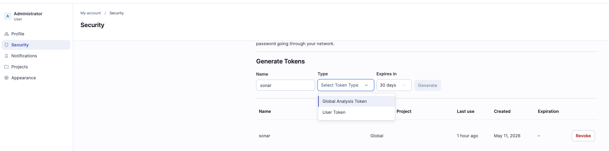

# Autoservice — API da oficina (MVP)

Back-end monolítico em camadas (**Spring Boot 3**, **Java 21**) para gestão de **ordens de serviço**, **clientes**, *
*veículos**, **peças**, **estoque**, **ordens de compra**, **catálogo de serviços** e **métricas de tempo de execução**.

Documentação interativa: **`/swagger-ui.html`** (OpenAPI em **`/v3/api-docs`**).

## Objetivos do projeto

- Formalizar o fluxo de **atendimento → diagnóstico → orçamento → aprovação → execução → entrega**.
- Centralizar **cadastros** e **estoque** com rastreabilidade.
- Oferecer **acompanhamento da OS** por API (`GET /ordens-servico/{id}/andamento`).
- Dar suporte à disciplina de **DDD** (domínio, aplicação, infraestrutura, apresentação) e qualidade (testes, cobertura
  nos pacotes de domínio/aplicação).

## Requisitos de repositório atendidos

Este repositório reúne os principais elementos do projeto de aplicação principal em Kubernetes:

- Código-fonte da API principal em Spring Boot.
- Dockerfile para build da imagem da aplicação.
- Manifestos Kubernetes em `/k8s` com Deployment, Service, HPA, ConfigMap, Secret e Ingress.
- Observabilidade com logs estruturados em JSON, métricas e endpoints de saúde em `/health`, `/live` e `/ready`.
- Pipeline CI/CD em `.github/workflows/ci-cd.yml` para build/test, push da imagem e deploy no cluster.
- Documentação de API em Swagger/OpenAPI + Postman e comandos para execução local.

## Desafio corporativo: requisitos atendidos

A arquitetura deste repositório foi alinhada ao desafio de escala corporativa da oficina:

- Autenticação e API Gateway: o fluxo de autenticação por CPF é executado por uma Lambda Serverless externa e o token JWT é consumido pela aplicação principal via API Gateway/Ingress.
- Segurança: rotas sensíveis são protegidas com JWT e endpoints públicos restritos a autenticação, Swagger e healthchecks.
- Observabilidade: logs estruturados em JSON, métricas do Spring Actuator, integração com Datadog e endpoints `/health`, `/live`, `/ready` para monitoramento e alertas.
- Escalabilidade: deployment com HPA, recursos de CPU/memória e ingress para múltiplas unidades.
- CI/CD: pipeline com validação, testes, build de imagem, push para registry e deploy automatizado em ambiente homolog/prod.
- Proteção de branch: GitHub Actions e política de PR obrigatória para merge nas branches principais.

### Endpoints de saúde

- `GET /health` — verificações gerais da aplicação
- `GET /live` — liveness probe (aplicação viva)
- `GET /ready` — readiness probe (aplicação pronta para receber tráfego)
- `GET /actuator/health` — endpoint padrão do Spring Actuator

### Contrato JWT e acesso por CPF

A Lambda deve emitir JWT assinado com HS256, usando o segredo configurado em
`AUTOSERVICE_JWT_SECRET`, `iss` igual a `AUTOSERVICE_JWT_ISSUER` (padrao:
`autoservice-auth`), `sub` contendo o CPF, `roles` contendo `CUSTOMER` e `exp`
com expiracao futura. Tokens sem `exp`, com expiracao nula/vencida, assinatura
invalida ou outro issuer sao recusados com HTTP 401.

Envie `Authorization: Bearer <token>` nas chamadas protegidas. O CPF utilizado
na autorizacao e o `sub`, nao um claim separado `cpf`. A Lambda permanece
responsavel por consultar a existencia e o status do cliente na emissao.

Para clientes, `POST /atendimentos` e `GET /clientes/cpf/{cpf}` exigem o mesmo
CPF do token. Os GETs `/ordens-servico/{id}/andamento`,
`/ordens-servico/{id}/aprovacao/aprovar` e
`/ordens-servico/{id}/aprovacao/reprovar` conferem a titularidade pelo
relacionamento OS -> veiculo -> cliente -> pessoa fisica. OS de terceiros,
inexistentes ou sem proprietario pessoa fisica com CPF retornam HTTP 403.
Abrir um link de e-mail sem enviar o token nao autentica o cliente.

O acesso de `ADMIN` e preservado, inclusive para OS de pessoa juridica.
Os PATCHs de aprovacao/reprovacao continuam exclusivos de `ADMIN`. O login
interno em `/auth/login` continua disponivel para usuarios da aplicacao.
Healthchecks `/health`, `/live` e `/ready` permanecem publicos.

## Por que PostgreSQL?

Foi adotado **PostgreSQL** por ser **open-source**, amplamente usado em produção, com forte suporte a **integridade
referencial**, **transações ACID**, tipos numéricos/decimais para valores monetários e adequação a dados relacionais (
clientes, veículos, OS, itens, estoque). O driver oficial integra-se bem com **Spring Data JPA** e com ambientes
containerizados.

## Como rodar localmente

### Pré-requisitos

- **JDK 21**
- **Maven** (ou use o wrapper `./mvnw` na raiz do projeto)
- **PostgreSQL** acessível (ou **Docker** — ver pasta `docker/`)

### Variáveis e porta

Por padrão (`src/main/resources/application.yaml`):

| Variável / propriedade       | Exemplo                                        | Descrição                                                      |
|------------------------------|------------------------------------------------|----------------------------------------------------------------|
| `server.port`                | `8088`                                         | Porta HTTP                                                     |
| `SPRING_DATASOURCE_URL`      | `jdbc:postgresql://localhost:5432/autoservice` | JDBC                                                           |
| `SPRING_DATASOURCE_USERNAME` | `postgres`                                     | Usuário                                                        |
| `SPRING_DATASOURCE_PASSWORD` | `postgres`                                     | Senha                                                          |
| `APP_BASE_URL`               | `http://localhost:8088`                        | Base URL nos links de orçamento                                |
| `MAIL_*`                     | opcional                                       | SMTP para envio de orçamento (defaults apontam para localhost) |

Crie o banco `autoservice` no Postgres ou use o `docker-compose` da pasta `docker/`.

Copie `local.variable.env.example` para `local.variable.env` e ajuste os valores (JWT, mail, datasource).

### Build e execução

```bash
./mvnw clean verify    # testes + relatório JaCoCo em target/site/jacoco
./mvnw spring-boot:run
```

Abra o Swagger em: **http://localhost:8088/swagger-ui.html**

### Docker (Postgres + aplicação)

Na raiz do repositório:

```bash
docker compose -f docker/docker-compose.yaml up --build
```

- **Postgres:** porta **5432**
- **API:** porta **8088**

O `Dockerfile` está em **`docker/Dockerfile`** (build multi-stage com Maven + JRE 21).

### Kubernetes (K8s)

Os manifestos para deploy estão em **`/k8s`**, incluindo:

- `Deployment`, `Service`, `ConfigMap`, `Secret` e `HPA` da aplicação;
- `Deployment`, `Service`, `ConfigMap`, `Secret` e `PVC` do PostgreSQL;
- `kustomization.yaml` para aplicar todos os recursos de uma vez.

Antes do deploy, crie os secrets a partir dos exemplos:

```bash
cp k8s/11-secret-app.example.yaml k8s/11-secret-app.yaml
cp k8s/21-secret-postgres.example.yaml k8s/21-secret-postgres.yaml
# edite os arquivos com valores reais (não commitar)
kubectl apply -f k8s/11-secret-app.yaml
kubectl apply -f k8s/21-secret-postgres.yaml
```

Ou use `kubectl create secret generic` (como no pipeline CI/CD).

Ajuste também `k8s/30-deployment-app.yaml` (`image`, caso use outro registry/tag).

Imagem padrão da aplicação no manifesto:

- `ghcr.io/cristhian-ruescas/autoservice:latest`

Validação local dos manifestos (sem aplicar no cluster):

```bash
kubectl apply --dry-run=client -k k8s
```

Aplicar no cluster:

```bash
kubectl apply -k k8s
```

Verificar rollout:

```bash
kubectl -n autoservice get pods
kubectl -n autoservice get svc
kubectl -n autoservice get hpa
kubectl -n autoservice rollout status deployment/autoservice-postgres
kubectl -n autoservice rollout status deployment/autoservice-app
```

### CI/CD (GitHub Actions)

Pipeline em **`.github/workflows/ci-cd.yml`** com etapas de:

- build da aplicação;
- execução dos testes automatizados;
- validação dos manifestos Kubernetes (`kubectl kustomize`);
- build/push da imagem Docker no GHCR (push em `main`/`master`);
- deploy do banco e da aplicação no Kubernetes (push em `main`/`master`).

Dispara em `push`/`pull_request` para `main`, `master` e `develop` (deploy completo apenas em `main`/`master`).

Secrets obrigatórios no ambiente `production`:

- `KUBECONFIG` (arquivo kubeconfig em base64);
- `POSTGRES_PASSWORD`;
- `AUTOSERVICE_JWT_SECRET`;
- `MAIL_USERNAME`;
- `MAIL_PASSWORD`.

## Arquitetura proposta (Fase 2)

```text
Cliente/Front
    |
    v
Ingress/Service (K8s) ---> autoservice-app (Deployment + HPA)
                                |
                                v
                        autoservice-postgres (Deployment + PVC)

CI/CD (GitHub Actions)
    -> build/test
    -> build/push imagem
    -> apply k8s (db + app)
```

## Infraestrutura como Código (Terraform)

Os scripts Terraform estão em **`/infra`** para provisionamento do cluster Kubernetes (K3d) e banco de dados via Helm.

### Provisionamento com Terraform

```bash
cd infra

# Revisar plano de provisionamento
terraform init
terraform plan

# Aplicar provisioning (cria cluster K3d + PostgreSQL)
terraform apply
```

**Variáveis e configuração:** Ver [infra/README.md](./infra/README.md) para instruções completas e customização de passwords/nomes.

**Recursos criados:**
- Cluster Kubernetes local (K3d com nome padrão `autoservice-local`)
- PostgreSQL via Helm Bitnami chart
- Namespace `autoservice`
- ConfigMaps e Secrets para aplicação

Após aplicar, validar cluster com:
```bash
kubectl cluster-info
kubectl get pods -n autoservice
kubectl get services -n autoservice
```

## Checklist de entrega — Go/No-Go (Fase 2)

### Go (concluído no repositório)

- [x] Refatoração em camadas (DDD/hexagonal) e código atualizado;
- [x] Testes automatizados unitários e de integração (613 testes; 2 integrações com schema Testcontainers pendentes no ambiente WSL);
- [x] Dockerfile e docker-compose;
- [x] Manifestos Kubernetes em `/k8s` (Deployment/Service/ConfigMap/Secret/HPA/PVC);
- [x] Pipeline CI/CD em `.github/workflows/ci-cd.yml`;
- [x] Scripts Terraform em `/infra` e documentação de provisionamento;
- [x] Link da collection completa de APIs (Postman/Swagger — [`Autoservice API.postman_collection.json`](./Autoservice%20API.postman_collection.json)).

### No-Go (pendente para entrega final)

- [ ] Publicar link do vídeo de demonstração (YouTube/Vimeo, até 15 min);
- [ ] Validar execução completa do CI/CD em ambiente real com cluster ativo (requer secrets GitHub);
- [ ] Gerar PDF final com link do repositório, arquitetura e vídeo.

## Testes e cobertura

- **Unitários** e **integração** (Testcontainers + Postgres quando o Docker está disponível).
- Testes de integração com `@EnabledIf` ignoram o ambiente sem Docker.
- **JaCoCo** (`pom.xml`): relatório na fase `test`; regra de cobertura aplicada ao bundle configurado (exclui, entre
  outros, `presentation` e `infrastructure` do relatório de verificação — alinhado ao foco em **domínio** e **casos de
  uso**).

## Qualidade e vulnerabilidades com SonarQube

O projeto possui SonarScanner for Maven configurado no `pom.xml` e um SonarQube local no Docker Compose via profile
`quality`.

Suba o SonarQube:

```bash
docker compose -f docker/docker-compose.yaml --profile quality up -d sonarqube
```


Acesse `http://localhost:9000`. Caso credenciais de acesso sejam solicitadas pelo Sonar, utilize o login padrão:
```bash
usuario: admin
senha: admin
```

Crie um token de análise como na imagem abaixo. Clique no seu perfil e vá para **My Account > Security**:


Para publicar a análise no SonarQube, execute:

```bash
export SONAR_TOKEN=<token-gerado-no-sonarqube>
./mvnw clean verify sonar:sonar
```

O projeto é publicado com a chave `com.autoservice:autoservice`.

Para gerar o relatório de vulnerabilidades usado na entrega, utilize um **User Token** do SonarQube, pois tokens apenas
de análise podem não ter permissão para consultar Security Hotspots pela API:

```bash
export SONAR_TOKEN=<user-token-gerado-no-sonarqube>
./scripts/generate-sonar-security-report.sh
```

O relatório consolidado é gerado em:

[docs/security/sonar-vulnerability-report.md](docs/security/sonar-vulnerability-report.md)

O script responsável pela geração está em:

[scripts/generate-sonar-security-report.sh](scripts/generate-sonar-security-report.sh)

As respostas brutas da API do SonarQube são salvas em:

```text
target/sonar-security/
```

## Principais recursos da API

| Área                               | Base path                                       |
|------------------------------------|-------------------------------------------------|
| Atendimento / abertura de OS       | `/atendimentos`                                 |
| Ordens de serviço                  | `/ordens-servico`                               |
| Métricas (tempo médio de execução) | `/ordens-servico/metricas/tempo-medio-execucao` |
| Catálogo de serviços               | `/servicos`                                     |
| Peças                              | `/pecas`                                        |
| Estoque                            | `/estoques`                                     |
| Ordens de compra                   | `/ordens-compra`                                |

### Documentação interativa

- **Swagger/OpenAPI:** `http://localhost:8088/swagger-ui.html` (em execução local)
- **OpenAPI JSON:** [`openapi.json`](./openapi.json)

### Postman Collection

Importar collection no Postman: **[`Autoservice API.postman_collection.json`](./Autoservice%20API.postman_collection.json)**

**Alternativamente,** acessar Swagger em tempo real quando a aplicação estiver rodando:
```bash
# Com Docker Compose
docker compose -f docker/docker-compose.yaml up

# Ou com Maven
./mvnw spring-boot:run

# Acessar
open http://localhost:8088/swagger-ui.html
```

## Decisões de modelagem do MVP

### Criação de cliente e veículo no fluxo de atendimento

No MVP, a criação de cliente e veículo foi centralizada em `POST /atendimentos`, que já abre a OS inicial no status
`RECEBIDO`.
Essa decisão evita cadastros órfãos e mantém o primeiro registro do atendimento (cliente, veículo e relato inicial) de
forma transacional.

Os endpoints administrativos de clientes e veículos cobrem listagem, consulta, atualização e remoção (`GET`, `PUT`,
`DELETE`), enquanto o `create` ocorre no fluxo principal de negócio.

### Controle de estoque orientado a eventos de negócio

O controle de estoque é atualizado automaticamente por eventos do domínio:

- entrada ao realizar ordem de compra;
- baixa ao finalizar execução da OS.

Assim, o saldo de estoque permanece consistente com o ciclo operacional da oficina.

## Licença / uso acadêmico

Projeto desenvolvido no contexto do **Tech Challenge** (pós-graduação SOAT).
