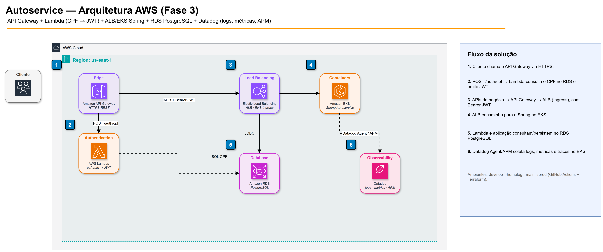

# Autoservice — API da oficina

Back-end monolítico em camadas (**Spring Boot 3**, **Java 21**) para gestão de **ordens de serviço**, **clientes**, **veículos**, **peças**, **estoque**, **ordens de compra**, **catálogo de serviços** e **métricas de tempo de execução**.

Este repositório é a **aplicação principal** do Tech Challenge (SOAT). As fases se **complementam**:

| Fase | O que entrou neste repositório |
|------|--------------------------------|
| **1** | Domínio da oficina, APIs REST, Swagger, Postman, testes |
| **2** | Docker, Kubernetes local (`/k8s`), HPA, CI/CD, Terraform K3d (`/infra`), SonarQube |
| **3** | Consumo de JWT (CPF via Lambda externa), overlay **EKS + RDS**, logs JSON, **Datadog** (APM/métricas/logs), integração com API Gateway |

Documentação interativa: **`/swagger-ui.html`** (OpenAPI em **`/v3/api-docs`**).

---

## Propósito (este repositório)

- Expor as APIs de negócio da oficina em **Kubernetes**.
- Validar **JWT** emitido pela Lambda de autenticação por CPF (`autoservice-lambda-auth`).
- Persistir dados em **PostgreSQL** (local na Fase 2; **Amazon RDS** na Fase 3).
- Emitir **telemetria** (logs estruturados, métricas, traces) para **Datadog**.
- Manter qualidade: DDD em camadas, testes automatizados e cobertura focada em domínio/aplicação.

### Ecossistema (4 repositórios)

| Repositório | Papel |
|-------------|--------|
| **autoservice** (este) | API Spring no Kubernetes |
| [autoservice-lambda-auth](https://github.com/Zainequeiros/autoservice-lambda-auth) | Serverless `POST /auth/cpf` → JWT |
| [autoservice-infra-k8s](https://github.com/Zainequeiros/autoservice-infra-k8s) | Terraform: VPC, EKS, ALB, API Gateway, Datadog Agent |
| [autoservice-infra-db](https://github.com/Zainequeiros/autoservice-infra-db) | Terraform: Amazon RDS PostgreSQL |

Documentação arquitetural (diagramas oficiais): [Miro — Autoservice](https://miro.com/app/board/uXjVHprBYf0=/).

---

## Tecnologias

| Camada | Tecnologia |
|--------|------------|
| Linguagem / runtime | Java 21, Spring Boot 3 |
| Persistência | Spring Data JPA, PostgreSQL |
| API | REST, Springdoc OpenAPI (Swagger) |
| Segurança | JWT HS256 (`AUTOSERVICE_JWT_SECRET` alinhado à Lambda) |
| Containers | Docker multi-stage (`docker/Dockerfile`) |
| Orquestração | Kubernetes (local `/k8s` · EKS overlay `/k8s/eks`) |
| Observabilidade | Actuator, logs JSON, Datadog Agent/APM |
| Qualidade | JUnit, Testcontainers, JaCoCo, SonarQube |
| CI/CD | GitHub Actions (`.github/workflows/ci-cd.yml`) |

---

## Diagrama da arquitetura (este repositório no contexto cloud)

**Visão Fase 3 (AWS):**



- Fonte editável: [`docs/observability/diagrams/autoservice-aws-architecture.drawio`](docs/observability/diagrams/autoservice-aws-architecture.drawio)
- Board completo (componentes, sequências, ER, K8s): [Miro](https://miro.com/app/board/uXjVHprBYf0=/)

```text
Cliente
  │
  ├─ POST /auth/cpf ──────────────► API Gateway ──► Lambda cpf-auth ──► RDS
  │                                      │              (JWT)
  │                                      │
  └─ APIs + Bearer JWT ──────────────────┴──► ALB / Ingress ──► EKS (este repo)
                                                                  │
                                                                  ├─ JDBC ──► RDS
                                                                  └─ Agent/APM ──► Datadog
```

**Visão Fase 2 (local / K3d)** — ainda válida para desenvolvimento:

```text
Cliente/Front
    │
    v
Ingress/Service (K8s) ---> autoservice-app (Deployment + HPA)
                                │
                                v
                        autoservice-postgres (Deployment + PVC)
                                ou
                        Postgres via Docker Compose / RDS
```

---

## Link Swagger / Postman

| Recurso | Onde |
|---------|------|
| **Swagger (local)** | http://localhost:8088/swagger-ui.html |
| **OpenAPI JSON** | [`openapi.json`](./openapi.json) |
| **Postman** | [`Autoservice API.postman_collection.json`](./Autoservice%20API.postman_collection.json) |
| **Swagger (homolog via Gateway)** | `https://<api-gateway>/swagger-ui.html` — URL atual = output `api_gateway_url` do `autoservice-infra-k8s` (homolog) |

Rotas de autenticação relevantes na Fase 3:

| Endpoint | Onde roda | Auth |
|----------|-----------|------|
| `POST /auth/cpf` | API Gateway → Lambda | body `{ "cpf": "..." }` |
| `POST /auth/login` | App (ADMIN) | credenciais admin |
| `GET /ordens-servico/{id}/andamento` | App | JWT ADMIN ou CLIENTE (CPF dono) |
| `POST /atendimentos` | App | JWT ADMIN |

Detalhes EKS: [`k8s/eks/README.md`](k8s/eks/README.md).

---

## Objetivos do projeto (desde a Fase 1)

- Formalizar o fluxo de **atendimento → diagnóstico → orçamento → aprovação → execução → entrega**.
- Centralizar **cadastros** e **estoque** com rastreabilidade.
- Oferecer **acompanhamento da OS** por API (`GET /ordens-servico/{id}/andamento`).
- Manter disciplina **DDD** (domínio, aplicação, infraestrutura, apresentação) e qualidade (testes, cobertura).

## Requisitos atendidos (evolução até a Fase 3)

- Código-fonte da API principal em Spring Boot.
- Dockerfile para build da imagem.
- Manifestos Kubernetes em `/k8s` (local) e overlay `/k8s/eks` (cloud + RDS).
- Observabilidade: logs JSON, Actuator (`/health`, `/live`, `/ready`, `/actuator/health`), integração **Datadog**.
- Pipeline CI/CD: build/test, validação de manifests, push de imagem e deploy.
- Documentação Swagger/OpenAPI + Postman.
- Autenticação por CPF via Lambda externa; JWT consumido na app (rotas sensíveis protegidas).

### Endpoints de saúde

- `GET /health` — verificações gerais
- `GET /live` — liveness
- `GET /ready` — readiness
- `GET /actuator/health` — Spring Actuator

---

## Por que PostgreSQL?

Foi adotado **PostgreSQL** por ser **open-source**, amplamente usado em produção, com forte suporte a **integridade referencial**, **transações ACID**, tipos numéricos/decimais para valores monetários e adequação a dados relacionais (clientes, veículos, OS, itens, estoque). O driver oficial integra-se bem com **Spring Data JPA** e com ambientes containerizados.

Na Fase 3 o mesmo motor roda como **Amazon RDS for PostgreSQL** (repositório `autoservice-infra-db`).

---

## Como rodar localmente

### Pré-requisitos

- **JDK 21**
- **Maven** (ou wrapper `./mvnw`)
- **PostgreSQL** acessível (ou **Docker** — pasta `docker/`)

### Variáveis e porta

Por padrão (`src/main/resources/application.yaml`):

| Variável / propriedade | Exemplo | Descrição |
|------------------------|---------|-----------|
| `server.port` | `8088` | Porta HTTP |
| `SPRING_DATASOURCE_URL` | `jdbc:postgresql://localhost:5432/autoservice` | JDBC |
| `SPRING_DATASOURCE_USERNAME` | `postgres` | Usuário |
| `SPRING_DATASOURCE_PASSWORD` | `postgres` | Senha |
| `AUTOSERVICE_JWT_SECRET` | *(mesmo da Lambda)* | Validação JWT |
| `APP_BASE_URL` | `http://localhost:8088` | Base URL nos links de orçamento |
| `MAIL_*` | opcional | SMTP |

Crie o banco `autoservice` ou use o `docker-compose` da pasta `docker/`.

Copie `local.variable.env.example` → `local.variable.env` e ajuste (JWT, mail, datasource).

### Build e execução

```bash
./mvnw clean verify    # testes + JaCoCo em target/site/jacoco
./mvnw spring-boot:run
```

Swagger: **http://localhost:8088/swagger-ui.html**

### Docker (Postgres + aplicação)

```bash
docker compose -f docker/docker-compose.yaml up --build
```

- **Postgres:** `5432`
- **API:** `8088`
- **Dockerfile:** `docker/Dockerfile` (multi-stage Maven + JRE 21)

---

## Kubernetes

### Local (Fase 2) — `/k8s`

Inclui Deployment/Service/ConfigMap/Secret/HPA da app, Postgres no cluster (PVC) e `kustomization.yaml`.

```bash
cp k8s/11-secret-app.example.yaml k8s/11-secret-app.yaml
cp k8s/21-secret-postgres.example.yaml k8s/21-secret-postgres.yaml
# edite (não commitar secrets)
kubectl apply --dry-run=client -k k8s
kubectl apply -k k8s
kubectl -n autoservice get pods,svc,hpa
```

Imagem de referência nos manifests locais: `ghcr.io/cristhian-ruescas/autoservice:latest`.

### EKS + RDS (Fase 3) — `/k8s/eks`

Overlay sem Postgres no cluster (usa RDS). Guia: [`k8s/eks/README.md`](k8s/eks/README.md).

```powershell
Copy-Item k8s\eks\secret-app.example.yaml k8s\eks\secret-app.yaml
# preencher JWT + JDBC do RDS (mesmo JWT_SECRET da Lambda)
kubectl apply -f k8s/eks/secret-app.yaml
kubectl apply -k k8s/eks
kubectl -n autoservice get pods,svc,ingress
```

---

## CI/CD (GitHub Actions)

Workflow: **`.github/workflows/ci-cd.yml`** (`name: CI/CD`).

| Evento | O que roda |
|--------|------------|
| `push` / `pull_request` em `main`, `master`, `develop` | Build + testes + `kubectl kustomize` |
| `push` em `main` / `master` | Build/push imagem **GHCR** + deploy no runner **self-hosted** (k3d / ambiente `production`) |

Padrão do ecossistema: **`develop` → homolog (CI)** · **`main` → prod (CI + imagem + deploy)**.  
Deploy **EKS** (Fase 3) permanece via overlay [`k8s/eks`](k8s/eks) após o cluster do `autoservice-infra-k8s` estar no ar.

Secrets do deploy self-hosted: `AUTOSERVICE_JWT_SECRET`, `MAIL_*`, `SPRING_DATASOURCE_*`.

---

## Infraestrutura local com Terraform (Fase 2)

Scripts em **`/infra`** para cluster **K3d** + PostgreSQL via Helm. Detalhes: [`infra/README.md`](./infra/README.md).

```bash
cd infra
terraform init
terraform plan
terraform apply
```

Para **EKS / API Gateway / VPC** na AWS, use o repositório **`autoservice-infra-k8s`** (não este).

---

## Observabilidade (Fase 3)

- Logs estruturados em JSON na aplicação.
- Probes Actuator usadas pelo Kubernetes e pelo monitoramento.
- Datadog no EKS (Agent Helm no `autoservice-infra-k8s/observability`) + APM na app (`DD_API_KEY` / `DD_AGENT_HOST`).
- Dashboards e monitores: [`docs/observability/`](docs/observability/).

---

## Testes e cobertura

- Unitários e integração (Testcontainers + Postgres quando o Docker está disponível).
- **JaCoCo** no `pom.xml`: agent ativo nos testes (`prepare-agent`), relatório em `target/site/jacoco`, gate **≥ 80%** de linhas no domínio/aplicação (exclui `infrastructure` / `presentation`) na fase `verify`.

```bash
./mvnw clean verify
```

## Qualidade e vulnerabilidades (SonarQube)

```bash
docker compose -f docker/docker-compose.yaml --profile quality up -d sonarqube
# http://localhost:9000  (admin/admin na primeira vez)
export SONAR_TOKEN=<token>
./mvnw clean verify sonar:sonar
./scripts/generate-sonar-security-report.sh
```

Relatório: [`docs/security/sonar-vulnerability-report.md`](docs/security/sonar-vulnerability-report.md).

---

## Principais recursos da API

| Área | Base path |
|------|-----------|
| Atendimento / abertura de OS | `/atendimentos` |
| Ordens de serviço | `/ordens-servico` |
| Métricas (tempo médio) | `/ordens-servico/metricas/tempo-medio-execucao` |
| Catálogo de serviços | `/servicos` |
| Peças | `/pecas` |
| Estoque | `/estoques` |
| Ordens de compra | `/ordens-compra` |

---

## Decisões de modelagem do MVP (mantidas)

### Criação de cliente e veículo no fluxo de atendimento

A criação de cliente e veículo permanece centralizada em `POST /atendimentos`, que abre a OS em `RECEBIDO`, evitando cadastros órfãos e mantendo o primeiro registro de forma transacional.

### Controle de estoque orientado a eventos

- Entrada ao realizar ordem de compra.
- Baixa ao finalizar execução da OS.

---

## Checklist de entrega (fases)

### Consolidado (código neste repositório)

- [x] Camadas DDD / hexagonal
- [x] Testes automatizados + JaCoCo
- [x] Dockerfile e docker-compose
- [x] Manifestos Kubernetes + HPA
- [x] Overlay EKS (`k8s/eks`)
- [x] Pipeline CI/CD
- [x] Terraform local K3d (`/infra`)
- [x] Swagger + Postman
- [x] JWT / rotas protegidas (integração Fase 3)
- [x] Datadog (logs / métricas / APM)

### Entrega no portal (fora do código)

- [ ] Vídeo de demonstração (YouTube/Vimeo, até 15 min)
- [ ] PDF com links dos 4 repositórios, vídeo e documentações

---

## Licença / uso acadêmico

Projeto desenvolvido no contexto do **Tech Challenge** (pós-graduação SOAT).
