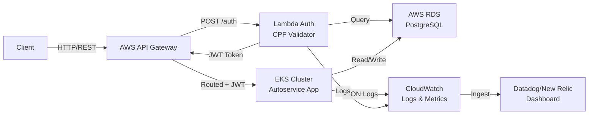
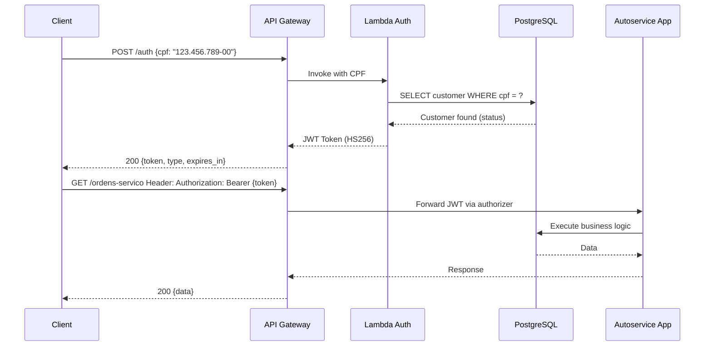
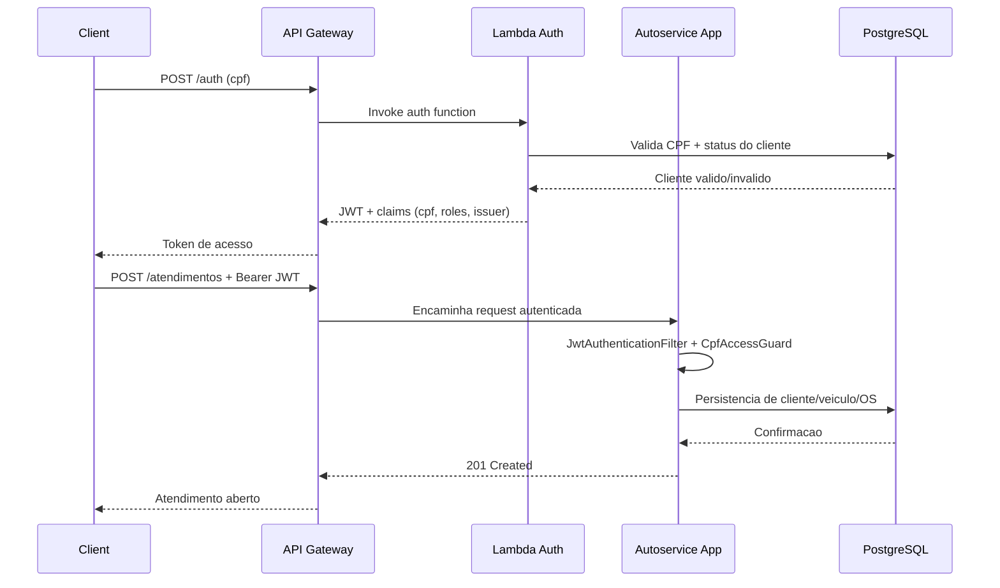
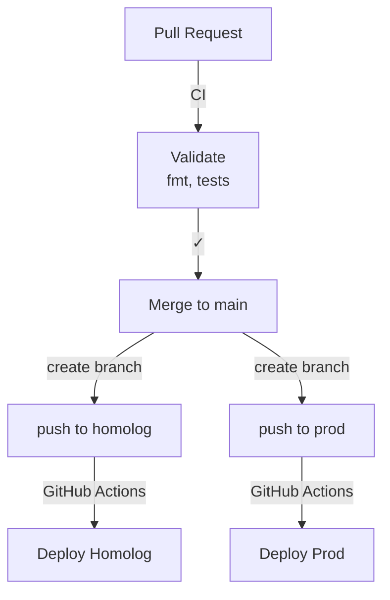

# Arquitetura do Tech Challenge

## Visão Geral

O Tech Challenge é uma aplicação de oficina de manutenção automotiva, estruturada em 4 repositórios separados, cada um com CI/CD, infraestrutura como código e observabilidade.

## Diagrama de Componentes

## Fluxo de Autenticação

## Fluxo de autenticação + abertura de ordem de serviço (detalhado)

## Componentes Principais

### 1. `autoservice-lambda-auth`
- **Responsabilidade**: Autenticação por CPF, geração de JWT
- **Tecnologia**: Java 21, AWS Lambda, RDS
- **Integração**: API Gateway via Authorizer
- **Deploy**: GitHub Actions com empacotamento Maven e `aws lambda update-function-*`

### 2. `autoservice-infra-db`
- **Responsabilidade**: RDS PostgreSQL gerenciado, backup, replicação
- **Tecnologia**: AWS RDS, Terraform
- **Ambientes**: homolog e prod
- **Deploy**: Terraform com backend S3 e lock DynamoDB

### 3. `autoservice-infra-k8s`
- **Responsabilidade**: Cluster EKS, VPC, networking, observabilidade
- **Tecnologia**: AWS EKS, Terraform, Kubernetes
- **Ambientes**: homolog e prod
- **Deploy**: Terraform com GitHub Actions

### 4. `autoservice`
- **Responsabilidade**: Aplicação principal (Spring Boot), lógica de negócio
- **Tecnologia**: Java 21, Spring Boot 3.5, Docker
- **Deploy**: Docker → ECR → EKS via GitHub Actions
- **Observabilidade**: JSON logs, X-Correlation-Id, health probes

## Fluxo de Deploy

## Estratégia de Segurança

- **Autenticação**: CPF + JWT via Lambda Authorizer
- **Autorização**: Spring Security com roles (ADMIN, USER)
- **Networking**: Cluster EKS em subnets privadas, apenas NAT Gateway para egress
- **Banco**: RDS em subnets privadas, acesso via security group
- **Secrets**: GitHub Secrets para credenciais, AWS Secrets Manager para runtime

## Observabilidade

### Logs
- Formato: JSON estruturado (Logback + Logstash encoder)
- Correlação: header `X-Correlation-Id` propagado em todas as requisições
- Retenção: 30 dias (homolog), 90 dias (prod)

### Métricas
- CloudWatch Metrics via Spring Boot Actuator
- HPA basado em CPU (70%) e memória (80%)
- Dashboard consolidado em Datadog/New Relic

Metricas de negocio expostas pela aplicacao:
- `autoservice.service_orders.opened.total`
- `autoservice.service_orders.status_transitions.total`
- `autoservice.notifications.webhook.result`
- `autoservice.notifications.webhook.latency`

### Alertas
- Falha de health check
- CPU > 80% ou memória > 90%
- Erro nas integrações
- Taxa de erro da API > 5%

Alertas objetivos recomendados para a entrega:
1. Falha no processamento de OS/notificacao:
   - `autoservice.notifications.webhook.result{result=exception|failed|interrupted} >= 3` em 5m.
2. Latencia de API:
   - p95 de rotas criticas (`/atendimentos`, `/ordens-servico/**`) > 800ms por 10m.
3. Taxa de erro:
   - respostas 5xx > 2% por 5m.
4. Uptime:
   - `actuator/health` com 2 falhas consecutivas em 2m.

## Decisões Arquiteturais

- ADRs locais (placeholder): `./adr/` *(preencher quando pasta for versionada neste repo)*.
- RFCs locais (placeholder): `./rfc/` *(preencher quando pasta for versionada neste repo)*.
- ADRs consolidados (repo oficial): `https://<PREENCHER-LINK-ADRS>`.
- RFCs consolidados (repo oficial): `https://<PREENCHER-LINK-RFCS>`.
