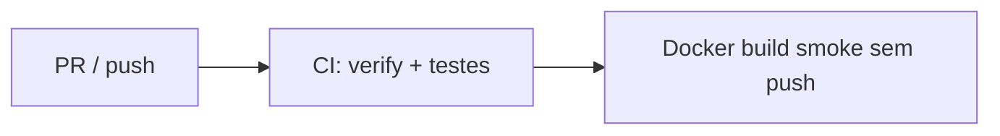

# CI — Autoservice

Pipeline GitHub Actions de **integração contínua**: build, testes e validação da imagem Docker (sem publicar em registry).

Ambiente local: `./mvnw spring-boot:run` ou `docker compose -f docker/docker-compose.yaml up --build`.

Deploy em registry / Kubernetes / Terraform ficam **fora deste escopo** (outros responsáveis ou entrega futura).

## Workflow

| Arquivo | Gatilho | O que faz |
|---------|---------|-----------|
| [`ci.yml`](../../.github/workflows/ci.yml) | PR para `main`/`develop`, push nessas branches, manual | Java 21, cache Maven, `mvn clean verify`, JaCoCo, smoke Docker build |



---
## Jobs

### `build-and-test`

| Step | Descrição |
|------|-----------|
| Checkout | Código do repositório |
| Setup Java 21 | Temurin + cache Maven |
| Maven verify | `./mvnw clean verify` — testes + gate JaCoCo ≥ 80% |
| Upload JaCoCo | Artefato `jacoco-report` (14 dias) |
| Upload Surefire | Só se falhar (7 dias) |
| Upload JAR | `autoservice-*.jar` (7 dias) |

Variáveis de ambiente: `AUTOSERVICE_JWT_SECRET`, `TESTCONTAINERS_RYUK_DISABLED`.

### `docker-build-smoke`

Builda `docker/Dockerfile` **sem push**, após `build-and-test` passar.

---

## Segredos

Nenhum secret manual é necessário — o CI usa apenas permissão `contents: read`.

---

## Comandos locais equivalentes

```powershell
$env:AUTOSERVICE_JWT_SECRET = "ci-jwt-secret-with-enough-length-for-hmac-sha256"
.\mvnw.cmd clean verify

docker build -f docker/Dockerfile -t autoservice:local .
docker compose -f docker/docker-compose.yaml up --build
```

---

## Troubleshooting

| Problema | Ação |
|----------|------|
| CI falha no JaCoCo | Docker deve estar ativo — testes Testcontainers skipped reduzem cobertura |
| Testes skipped | `@EnabledIf(dockerAvailable)` — normal sem Docker local |
| Smoke Docker falha | Verifique `docker/Dockerfile` e contexto na raiz do repo |
| Dependency review | Não usado — exige GitHub Advanced Security (pago/org) |

---

## Conformidade Fase 2 (trecho relevante)

| Requisito acadêmico | Este repo |
|---------------------|-----------|
| CI: build + testes | ✅ `ci.yml` |
| Build imagem Docker | ✅ smoke no CI + `docker/Dockerfile` / Compose local |
| Push registry / CD deploy | ❌ Fora do escopo deste PR |
| Kubernetes / Terraform | ❌ Outro responsável |
